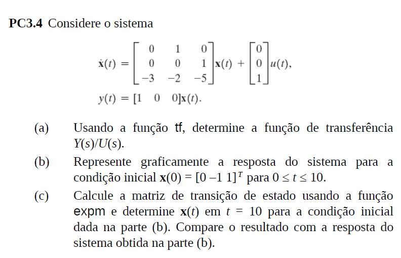

# **Atividade Extra 1 - Representação por Espaços de Estados**

## Enunciados do Livro *Sistemas de Controle Moderno - Dorf (13ª ed)*:

### Problema Computacional 3.4:

[Clique aqui](./PC3.4/PC3.4.ipynb) para acessar a resolução da PC3.4

### Problema Computacional 3.5:

[Clique aqui](./PC3.5/PC3.5.ipynb) para acessar a resolução da PC3.5

### Problema Computacional 3.6:

[Clique aqui](./PC3.6/PC3.6.ipynb) para acessar a resolução da PC3.6

### Problema Computacional 3.7:

[Clique aqui](./PC3.7/PC3.7.ipynb) para acessar a resolução da PC3.7

### Problema Computacional 3.8:

[Clique aqui](./PC3.8/PC3.8.ipynb) para acessar a resolução da PC3.8